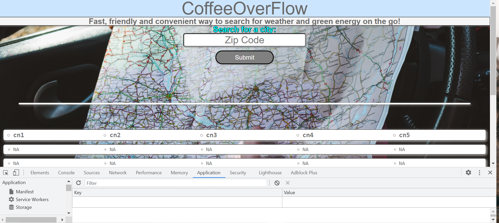
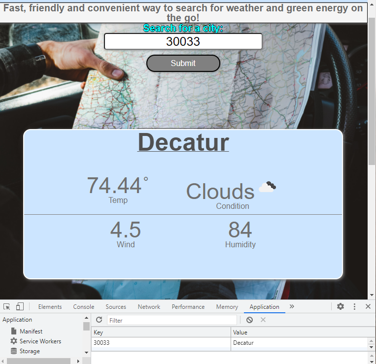
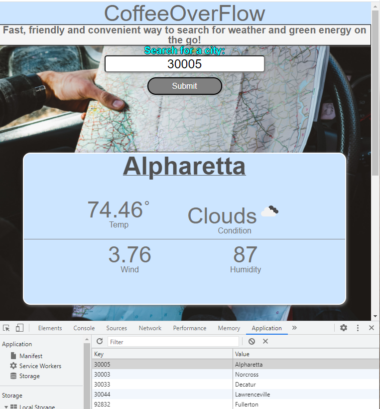

# CoffeeOverFlow

* Link access to the "CoffeeOverFlow" [Published Link](https://xtended99.github.io/CoffeeOverFlow/).
* Link access to the project page for "CoffeeOverFlow" [Repository Link](https://github.com/Xtended99/CoffeeOverFlow).
* Excited [Jump to program details](#Premise)
  
## End Goal

```
At the conclusion of each phase of this course, you’ll work with a group of your fellow students to create
a project. A project is collaborative work among a group of developers to create an application that solves
a real-world problem. Projects model the experience you’ll encounter in every development role at any  
company, from large multinational  businesses to small startups. Coding is collaborative.  
  
A project is a bit different from the Homework assignments you’ve worked on so far. One of the biggest differences  
is that you’ll no longer build an application by yourself! This has some advantages&mdash;you won’t have to do all  
of the work, you can divide up duties, and you can share skills and knowledge with other developers and lean on  
their strengths. This can also be challenging if you’re used to working alone. Constant communication and time management  
are just two of the skills you’ll need to practice to make sure everyone in your group works together to complete the project.  

Projects won’t provide you with a user story or acceptance criteria, because you and your group will create them  
once you decide which real-world problem your application will solve. This lack of constraints can be freeing  
in a way, because you have room to build what you want, but it also means that you have to decide what those  
constraints are before you can start working. 

Finally, a project requires a presentation, because you’re trying to convince an audience that it serves a purpose.  
Your instructional staff and fellow students are investors, and you’re pitching your creation to them&mdash an  
experience that developers are required to do frequently. Your presentation is just as important as the actual 
project, so take it just as seriously.  

```

## Project Requirements

```
You and your group will use everything you’ve learned over the past six units to create a real-world  
front-end application that you’ll be able to showcase to potential employers. The user story and acceptance  
criteria will depend on the project that you create, but your project must fulfil the following requirements:  

* Use a CSS framework other than Bootstrap.  
* Be deployed to GitHub Pages.  
* Be interactive (i.e., accept and respond to user input).  
* Use at least two [server-side APIs](https://coding-boot-camp.github.io/full-stack/apis/api-resources).  
* Does not use alerts, confirms, or prompts (use modals).  
* Use client-side storage to store persistent data.  
* Be responsive.  
* Have a polished UI.  
* Have a clean repository that meets quality coding standards (file structure, naming conventions,  
  follows best practices for class/id naming conventions, indentation, quality comments, etc.).  
* Have a quality README (with unique name, description, technologies used, screenshot, and link to 
   deployed application).  

```

## Presentation Requirements

```
Use this:  [project presentation template](https://docs.google.com/presentation/d/10QaO9KH8HtUXj__81ve0SZcpO5DbMbqqQr4iPpbwKks/edit?usp=sharing) to address the following:  

* Elevator pitch: a one minute description of your application  
* Concept: What is your user story? What was your motivation for development?  
* Process: What were the technologies used? How were tasks and roles broken down and assigned? What  
   challenges did you encounter? What were your successes?
* Demo: Show your stuff!  
* Directions for Future Development  
* Links to the deployed application and the GitHub repository  

```

## Grading Requirements

```
This project is graded based on the following criteria:

```

## Technical Acceptance Criteria: 25%  

```

* Satisfies the following code requirements:  
* Application uses at least two [server-side APIs](https://coding-boot-camp.github.io/full-stack/apis/api-resources)
* Application uses client-side storage to store persistent data.  
* Application doesn't use JS alerts, prompts, or confirms (uses modals instead).  
* Application uses a CSS framework other than Bootstrap.  
* Application is interactive (accepts and responds to user input)  

```

## Concept 10%  

```

* Application should be a unique and novel idea.  
* Your group should clearly and concisely articulate your project idea.  

```

## Deployment: 20%  

```

* Application deployed at live URL and loads with no errors.  
* Application GitHub URL submitted.  

```

## Repository Quality: 10%  

```

* Repository has a unique name.  
* Repository follows best practices for file structure and naming conventions.  
* Repository follows best practices for class/id naming conventions, indentation, quality comments, etc.  
* Repository contains multiple descriptive commit messages.  
* Repository contains a quality README file with description, screenshot, and link to deployed application.  

```

### Application Quality: 15%  

```
* Application user experience is intuitive and easy to navigate.  
* Application user interface style is clean and polished.  
* Application is responsive.  

```

## Presentation 10%  

```

* Your group should present using Powerpoint or a similar presentation software.  
* Every group member should speak during the presentation.  
* Your presentation should follow the [Project Presentation Template](https://docs.google.com/presentation/d/10QaO9KH8HtUXj__81ve0SZcpO5DbMbqqQr4iPpbwKks/edit?usp=sharing).  

```
## Collaboration 10%  

```

* There are no major disparities in the number of GitHub contributions between group members.  

```

_______________________________________________________________________


<h1 style="text-align: center;" markdown="1">Program details read on.</h3>

## Premise:

```

 * The entire UI is derived entirely from Semantic UI and plain vanila JavaScript.  
 * The idea behind the app is to build a UI that convenuently provides Weather information  
   in an easy to read format plus a listing of Green fuel alternatives energy supply stations.  
 * All the user has to do is provide the zip coded and click on the submit button,  
   a listing of the five day weather forcast including the current day is placed at the top   
   half of the screen. 
 * The bottom half includes a list of five energy supply stations with in your zipcode  
 * As an overall bonus the data is persisted to storage.

```

## Features included:

```

 *   Main features:  

     1. Hands off large fonts for easy viewing access.  
     2. Supply your zipcode and one button click does the rest for you.  
     3. Will accomodate much smaller viewports
     4. Autofocus is on the input field
 
```
 
## TODOS:

```

 *   Inclcude voice activation

```

## Please view the published link for a live experience!!!!  
  * Link access to the "CoffeeOverFlow" [Published Link](https://xtended99.github.io/CoffeeOverFlow/).  

```
 *   Source code details 
      1. index.html - is the main web page to access the mini app, from an  app perspectrive  
         this is the presentation and access layer.  
      2. script.js and heavy_lifting.js - are the core source code files, these files manage all of the  
         behind the scenes interaction.  
      3. style.css, main.css, baseline.css - manage all of the styling effects including postioning  
         of all of the viewable components the user interacts with.


## Thank You From the CoffeeOverFlow Crew
     
Enjoy!!!
 _______________________________________________________________________
```

### <span style="color:blue">**Application Images:**</span>
  
### **First Time usuage**   
     
    
### **Searching for a Decatur**   
      
  
### **Searching Alpharetta**   
      
  
### **Compact View**   
     
 

